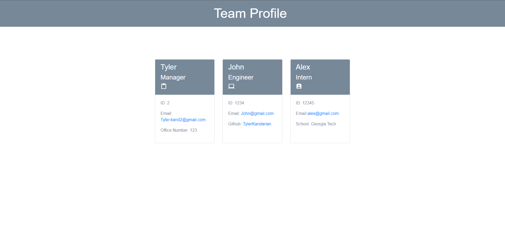

# Team-Profile-Generator

## Description

This application was made to create a HTML file that list Managers, Engineers and interns with their corresponding information.

## Table of Contents

- [Installation](#installation)
- [Usage](#usage)
- [License](#license)
- [Contributing](#contributing)
- [Tests](#tests)
- [Questions](#questions)

## Installation

To install, the user needs to clone the repo and have Node and jest installed. Once that is done the user can run the command npm test to run a test and use node index.js to use the generator.

## Usage

Video Walkthrough: https://app.castify.com/view/c149d6c8-9918-4aa8-b61b-03fae3888677

You use the Inquirer from your command line and then answer the questions about your Job title and description.

## License

This project is license under MIT

## Contributing

At this time there is no need to contribute.

## Tests

npm test
node index.js

## Questions

If you have any questions, please email me at Tyler.Kand2@gmail.com. You can also view more of my work at https://github.com/TylerKandarian.
